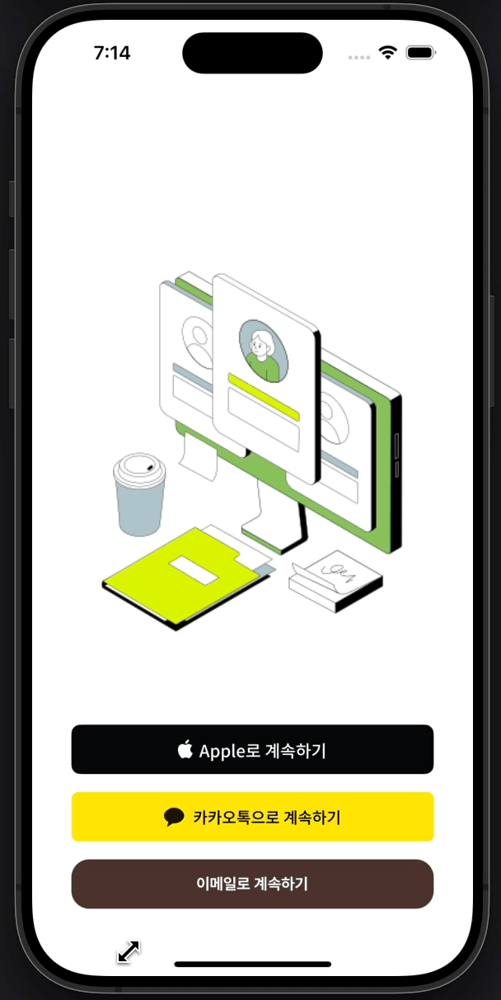
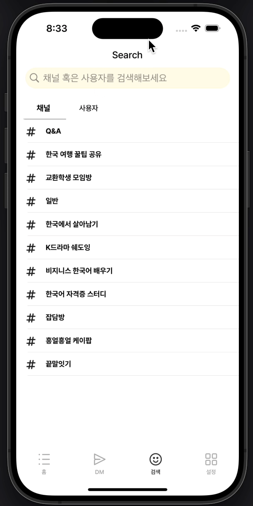

# Buddy Buddy
> 외국인 친구들과 실시간 채팅을 통해 서로의 언어를 교환하며 배울 수 있는 앱

## 개발 환경
```
- 개발 인원 : iOS 3명, BE 1명
- 개발 기간 : 2024.11.05 - 2024.12.09 (약 1달)
- Swift 5.10
- Xcode 15.3
- iOS 15.0+
- 세로모드/라이트 모드 지원
- 다국어(영어/한국어) 지원
```

## 기술스택

| 기술 | 버전 |
| -- | -- |
| UIKit | - |
| RxSwift | 6.8.0 |
| Alamofire | 5.10.1 |
| Nuke | 12.8.0 |
| Realm | 10.54.1 |
| SocketIO | 16.1.1 |

## 프로젝트 구조
#### Clean Architecture

- Data, Domain, Presentation 영역으로 분리
- Data: 서버와 통신, 채팅 DB관리, 소켓통신 관리
- Domain: repository에 있는 함수들을 조합하여 usecase를 정의하고 view에서 사용될 데이터 모델을 구성
- Presentation: UseCase를 통해 받은 데이터를 viewModel의 input, output을 통해 view로 전달하며, 단방향 데이터 플로우를 구성 *
  - input: 사용자의 입력과 이벤트를 받아 상태 변경 *
  - output: 변경된 상태와 데이터를 view에 전달하여 UI 업데이트 *

#### Coordinator Pattern

- 기존 ViewController 내부에서 화면 전환을 처리할 경우, 다른 ViewController와 높은 결합도 생성
- Coordinator 객체를 두고 화면 전환만을 담당하게 만들어, 결합도를 낮추고 화면 전환 로직 분리 시도

#### DIContainer
- 필요한 객체를 매번 생성하여 주입하는 과정에서 발생하는 비효율성과 객체 생성 비용의 낭비 발생 *
- 의존성을 일관되게 관리하고 재사용 가능한 구조를 만들기 위해 DIContainer를 도입 *
- usecase와 repository의 의존성 주입을 매번 해주는 번거로움을 줄이기 위해 DIContainer 도입
- 많이 사용되는 usecase와 repository 객체를 저장하고 필요 시 가져다 쓸 수 있도록 딕셔너리 형태로 구현

## 핵심 기능
| 플레이그라운드 목록 | 채널 채팅 | 유저 검색 후 DM 화면전환 | 실시간 채팅 |
| --- | --- | --- | --- |
|| | |  |

- (그룹, 개인) 채팅
- 소셜 로그인
- 유저, 채널 검색
- 유저 프로필 확인
- 플레이그라운드 및 채널 생성, 참여, 삭제, 수정, 관리자 권한 적용

## 주요 기술
- Socket 통신
    - socketIO 라이브러리를 이용하여 SocketManager, SocketIOClient 객체를 생성하고 소켓통신을 위한 url 연결 및 핸들러 등록
    - 메세지가 올 때 마다 RxSwift의 PublishRelay를 이용하여 이벤트를 방출하고 Presentation영역에서 구독하여 사용
    - SceneDelegate에서 백그라운드/포어그라운드 진입을 감지하여 notification을 통해 이벤트를 전달하고 백그라운드 시 소켓 연결을 해제하고, 포어그라운드 시 소켓 연결을 재설정하도록 구현
- 폴링 방식을 활용한 실시간 메세지 수신
    - 모든 채팅방에 대해 소켓통신을 열어놓아 메세지를 수신받는 것이 리소스 낭비라고 판단하여 폴링방식 도입
    - RxSwift의 interval 오퍼레이터를 이용하여 1초에 한번 씩 HTTP요청을 보내 채팅방 목록 업데이트
- NSCache, Disk Cache 구현
    - 프로필 이미지가 반복해서 나타나는 채팅방의 경우 매번 이미지를 통신하지 않고 캐시 도입
    - 업로드 되는 이미지에 대해 NS Cache, Disk Cache에 저장
    - filemanager기반 Disk Cache 구현
    - 처음 이미지 통신 시 메모리 캐시 확인 -> 이미지 없을 시 디스크 캐시 확인 -> 이미지 없을 시 이미지 통신 진행
- Network monitoring, 상태처리
    - 네트워크 통신이 끊겼을 때를 실시간으로 감시하여 끊길 시, 로딩화면을 띄어주어 사용자에게 알림
    - 네트워크 통신이 끊길 시, 모든 채팅방의 소켓통신을 해제
    - 네트워크 통신 시 상태 코드를 기준으로 에러를 분기하여 문제 발생 지점을 파악할 수 있도록 구성

## 트러블슈팅
### 1. DM 채팅방목록 로드가 각각 따로되고 시간이 오래걸리는 문제
- 상황
  - DM 채팅방 목록을 위해서는 DM 채팅방 목록 조회, 각 채팅방의 채팅 목록 조회, 안읽은 메세지 개수 조회 총 3개의 통신이 일어남
  - RxSwift의 interval 오퍼레이터를 사용하여 1초에 한번씩 트리거를 주어 3개의 통신을 계속 해주고 있음
  
- 원인 분석
  - 3개의 통신 중 어느하나라도 먼저 완료가 되면 다른 통신을 기다리지 않고 넘어가서 모든 데이터를 다 받아오지 못함
  - interval은 1초에 한번씩 이벤트를 방출하지만 처음 0초에는 방출하지 않아 1초 후에야 모든 통신이 시작됨

- 해결
  - Observable.zip을 사용하여 모든 통신이 다 끝났을 때 이벤트를 방출
  - interval 오퍼레이터 사용 시 처음에도 이벤트를 발생할 수 있도록 concat을 사용하여 Observable.just(0)을 같이 결합

### 2. 채팅방에 진입할 때 마다 이미지들을 모두 통신하여 시간이 많이 걸리는 문제
- 상황
  - 채팅방에 진입 시 프로필 이미지와 채팅방에 올라와 있는 이미지를 보여주기 위해 Realm에 저장되어 있는 이미지 경로를 이용하여 통신
  - 통신하여 받은 Data타입을 UIImage로 변환하여 보여줌
  
- 원인 분석
  - 채팅방에 진입할 때 마다 매번 이미지 통신을 하고 있어 채팅 로드 시간이 오래걸림

- 해결
  - NSCache, fileManager를 이용하여 CacheManager 구현
  - CacheManager 내부의 메모리 캐시, 디스크 캐시 확인 후 이미지 없을 시 이미지 통신 진행


## 회고
- DIContainer register 기준
- Coordinator


- 소켓 끊겼을 때 처리 + 재연결 시점 + 핑퐁 + 소켓 
- (다운 샘플링 찾아보기💥)